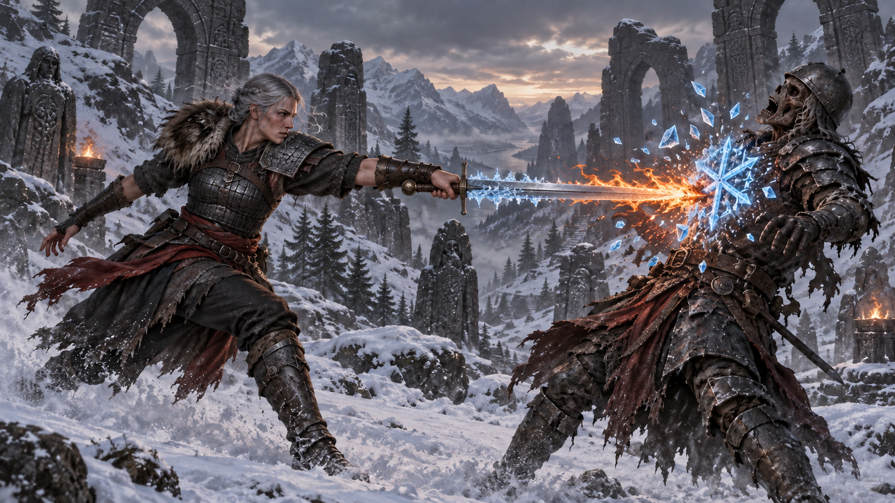
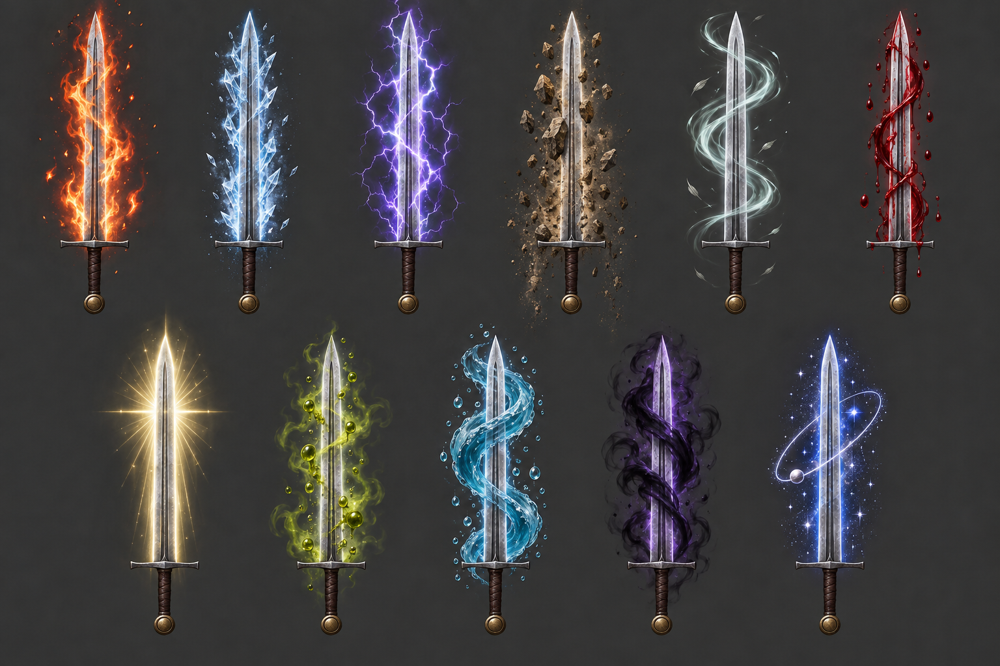
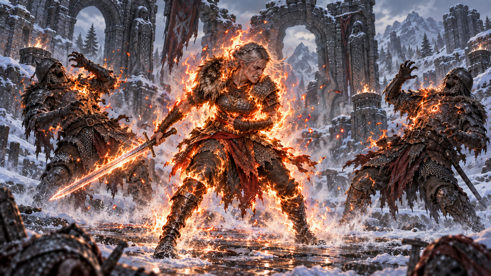
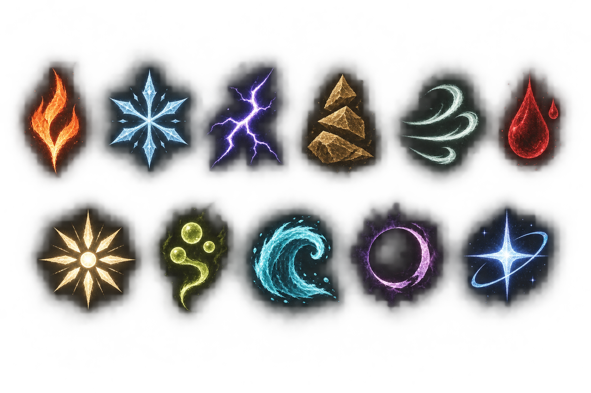
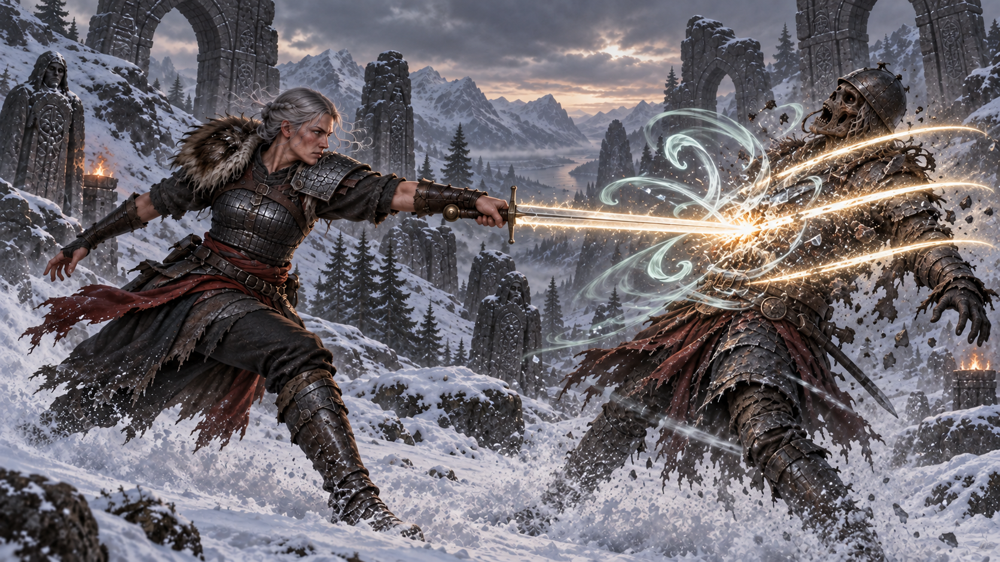
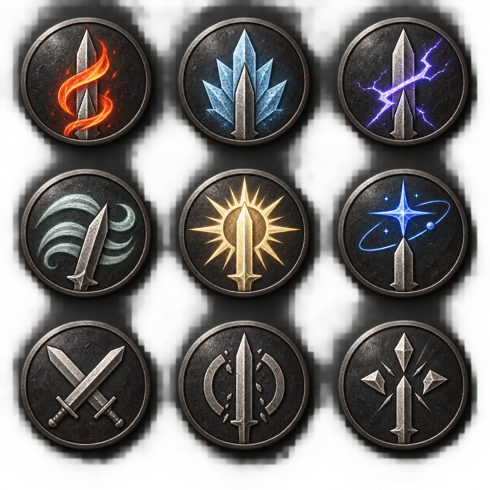

# 元素魔戰士 / Elements Spellblade

*An elemental melee spellblade: mark your foes, switch forms, and detonate the battlefield.*

*概念美術｜冰切火的接管瞬間；雙色刀光是概念表現，遊戲設計為即時換色。*

以武器近戰為核心，用熱鍵開啟火、冰、雷、地、風、血、聖、毒、水、暗、星共 11 種元素形態。武器命中留下印記，換元素後的第一擊觸發舊印記的終焉與新元素的開印；關閉形態則以「融斷」一次結清附近敵人的印記。

一般形態的元素視覺集中在武器，配合敵人印記與命中衝擊。火形態的「白熱」是例外：角色全身成為火源，灼燒貼身敵人，同時付出生命代價。

**狀態：開發中。** 目標版本為 Skyrim SE 1.5.97，規劃 SKSE 原生外掛。

**以下皆為 AI 生成概念美術，並非遊戲截圖，也不代表已實作的畫面。** 模組實際重用已安裝法術模組的視覺特效；圖中的角色、符印與圖示用於探索美術方向。此儲存庫不包含 vendor 檔案。

## 概念美術

*武器附魔｜上排由左至右：火、冰、雷、地、風、血；下排：聖、毒、水、暗、星。*

*白熱｜以自身為火源灼燒近敵，焦裂鎧甲與吃力姿態呈現代價。*

*敵人印記｜排列與武器表一致，以輪廓、色彩和流動方向區分元素。*

*元素反應｜風印記終焉後，由神聖接管，以三道光痕表現連續命中。*

*技能節點｜前兩排為火、冰、雷／風、聖、星；末排為無元素樹的純武藝、破魔、融斷。*

完整提示詞、元素順序與逐圖評註見 [概念畫冊](art-book/README.md)。

